# PlayWall

PlayWall is a JavaFX desktop client with a Spring Boot server backend for controlling interactive audio
presentations during live events. Media files are arranged as tiles ("pads") on one or more pages and can be
triggered manually, via keyboard shortcut, or via a MIDI controller, with support for fading, ramp-in, and
end-of-file warnings.

## License
This project is licensed under GPLv3.

## Features

### Pads

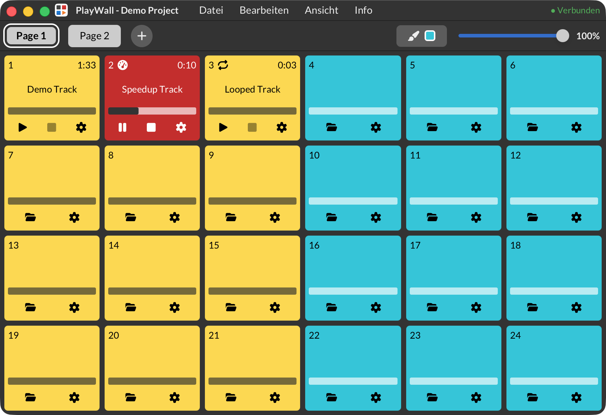

- Start, pause, and stop playback via the pad
- Select a media file via file dialog or drag & drop
- Set a title per pad
- Set an individual color per pad
- Show playback progress as a bar on the pad
- Stop all running pads with a single action

### Playback & Volume


- Adjust playback speed per track
- Set global volume for all pads
- Set volume per pad
- Loop playback of a track
- Select a sound card as output device
- Show a warning shortly before a track ends
- Set the duration of the ramp-in phase

### Project Management

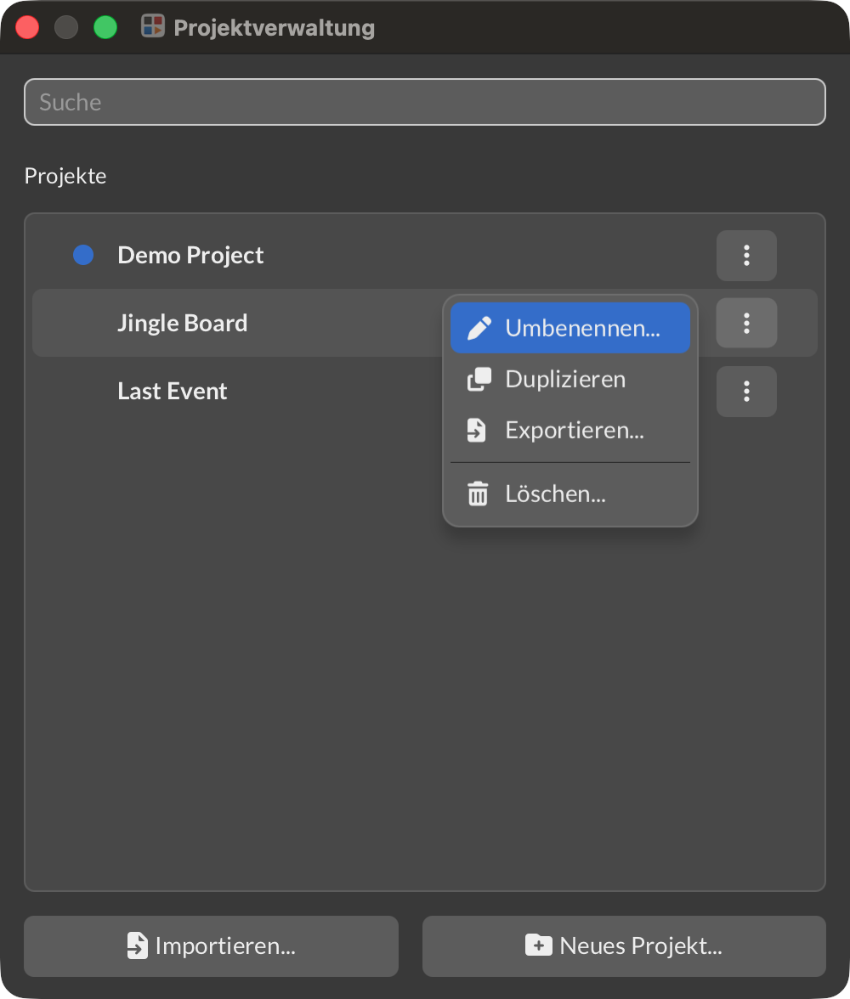

- Create, duplicate, and delete projects
- Export and import projects
- Undo/redo project changes

### Project Settings

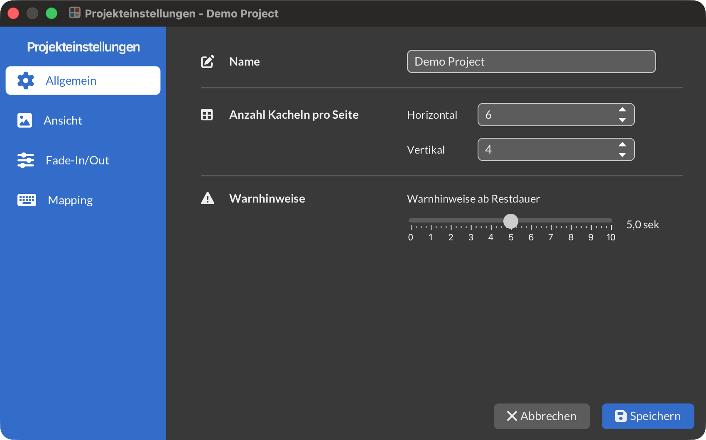

- Define grid layout in rows and columns
- Configure project display options
- Set a default color for pads in the project

### Page Management

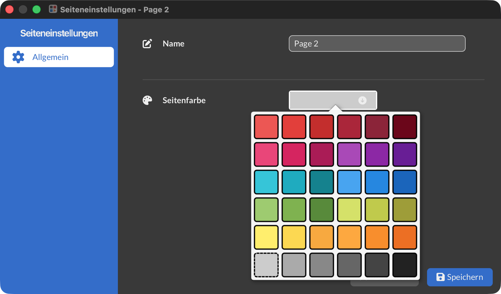

- Create, rename, duplicate, and delete pages
- Reorder pages
- Set a color per page
- Import and export pages between projects

### Drag & Drop

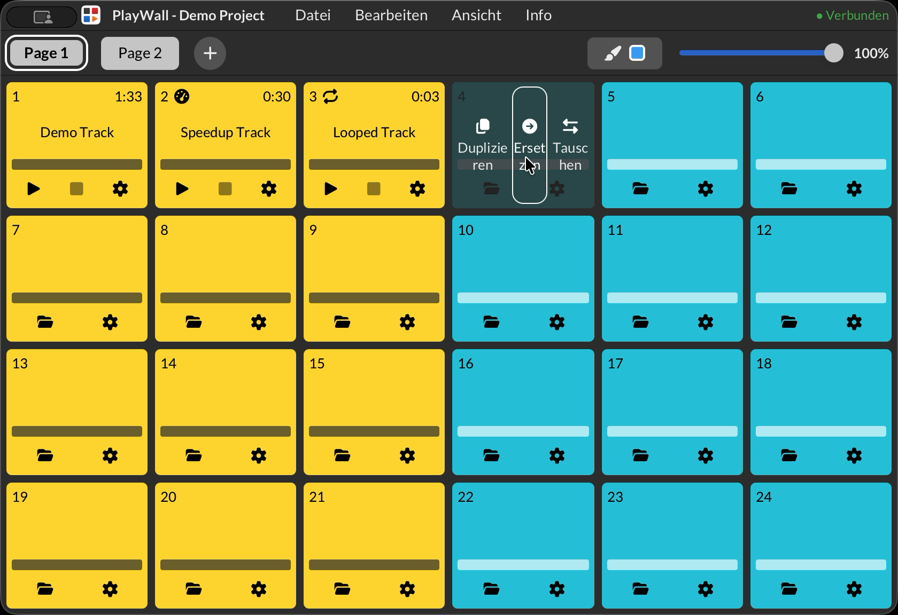

- Move or duplicate pads via drag & drop
- Swap two pads via drag & drop
- Add media files via drag & drop from the file system

### Fading

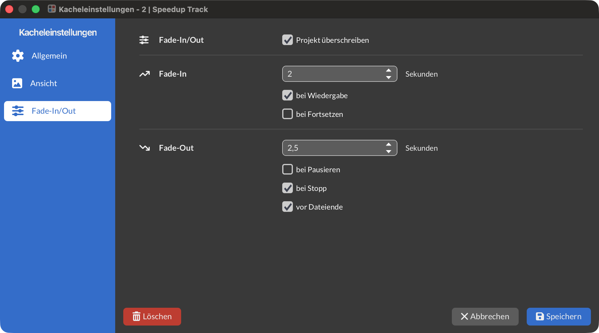

- Global fading settings at the project level
- Individual fading settings at the pad level
- Fade in on start and fade out on stop

### Keyboard & MIDI Control

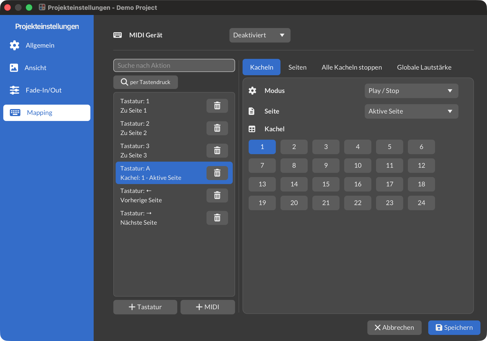

- Settings area for managing keyboard and MIDI mappings
- Record a key combination instead of entering it manually
- Select a MIDI device
- Learn MIDI keys and assign them to an action
- Trigger pads, page switching, global volume, and stop-all via keyboard or MIDI
- Show the status of pads, pages, and volume via LED feedback on the MIDI controller

### Companion Plugin

- Control PlayWall using Bitfocus Companion Plugin
- Trigger pads, page switching, global volume, and stop-all

### Handling Missing Media Files

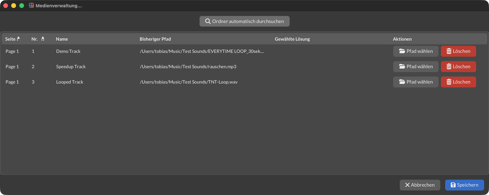

- Automatically detect missing media files
- Display a list of missing files
- Show a notice about missing media on startup

## Architecture

PlayWall consists of a JavaFX desktop client and a Spring Boot server, communicating over WebSocket and REST. Projects
are stored as files on disk (in `{appdata}/PlayWall/de.tobias.playwall.server.v8/`) — there is no database.

| Module                    | Role                                                      |
|---------------------------|-----------------------------------------------------------|
| `PlayWallCommon`          | Shared DTOs, network message types, sealed class protocol |
| `PlayWallServerCommon`    | Shared server interfaces                                  |
| `PlayWallServer`          | Spring Boot REST + WebSocket backend                      |
| `PlayWallClient`          | JavaFX desktop UI                                         |
| `PlayWallNativeAudio`     | JNI wrapper for native audio                              |
| `PlayWallNativeAudioRust` | Rust audio engine (rodio + symphonia via JNI)             |
| `PlayWallIconOverview`    | Internal developer tool for browsing available UI icons   |
| `coverage`                | JaCoCo aggregated test coverage report                    |

The client uses a custom dependency injection container (`AppContext`) instead of a framework like Spring.

Key technologies: Java 25, JavaFX, ControlsFX, Spring Boot, Lombok, MapStruct, and a Rust-based audio engine
integrated via JNI.

## System Requirements

### Linux

The Linux build ships a jlinked JavaFX runtime. JavaFX's prebuilt native libraries (`libglassgtk3.so` etc.) have a
minimum glibc version, which differs by CPU architecture:

| Architecture | Minimum glibc        | Supported distros (examples)                                                   |
|--------------|----------------------|--------------------------------------------------------------------------------|
| x86_64       | 2.17                 | virtually anything (Debian 8+, Ubuntu 14.04+)                                  |
| aarch64      | 2.38 (JavaFX 25.0.4) | Debian 13+, Ubuntu 23.10+ / 24.04+, Arch-based rolling releases (e.g. CachyOS) |

**Not supported on aarch64:** Debian 12 (glibc 2.36) and Ubuntu 22.04 (glibc 2.35) — the app fails to start with
`UnsatisfiedLinkError: ... libglassgtk3.so: ... version 'GLIBC_2.38' not found`.

This requirement comes from Gluon's aarch64 build infrastructure, not from our build config, and can change with future
JavaFX patch releases (unrelated to the JavaFX major version). If this becomes a blocker, re-check the required glibc
version for the pinned `javafx.version` before assuming it's fixed.

### Windows

- Minimum: **Windows 10 64-bit (version 1903+) or Windows 11** — matches Temurin JDK 25's supported baseline. No 32-bit
  builds.
- JavaFX bundles its own MSVC/UCRT runtime DLLs (`vcruntime140.dll`, `msvcp140*.dll`, `ucrtbase.dll` + the
  `api-ms-win-*` forwarder stubs) directly in the app image, so no separate "Visual C++ Redistributable" install is
  required on the target machine.

### macOS

- Minimum: **macOS 11 (Big Sur) or later**, on both Intel (x86_64) and Apple Silicon (arm64) — verified via the
  `LC_BUILD_VERSION` load command embedded in JavaFX 25.0.4's native libraries (`libglass.dylib` etc.). Unlike Linux,
  this has been stable across recent JavaFX versions and both architectures.

## Getting Started

### Prerequisites

- JDK 25
- Maven

### Build

```bash
mvn clean install
```

### Run

```bash
# Run the server (port 10023)
mvn spring-boot:run -pl PlayWallServer

# Run the client
mvn javafx:run -pl PlayWallClient
```

### Test

```bash
# Run tests for a specific module
mvn test -pl PlayWallClient

# Run UI tests headlessly (for CI)
mvn test -Pheadless-ui-tests

# Run audio tests (require hardware)
mvn test -Paudio-tests

# Build with a coverage report
mvn clean install -Pcode-coverage
```

### Additional build profiles

```bash
# Build the native Rust audio library
mvn install -Pbuild-rust -pl PlayWallNativeAudioRust

# Build platform installers (DMG/EXE/app image), matching the release pipeline
mvn clean install -Pbuild-rust,custom-jdk,package-executables
```

Building a complete installer requires `build-rust` and `custom-jdk` in addition to `package-executables` — running
`package-executables` on its own produces an app image missing the bundled Rust audio library and server runtime.
On macOS, signing and notarizing the installer additionally requires the `sign-dmg` and `sign-rust` profiles
together with the signing credentials described in [macOS Signing](#macos-signing).

SASS is compiled automatically during the build via the Maven dart-sass plugin (`src/main/sass/` →
`target/classes/style/`); no manual SASS compilation is needed.

## Development

### Using custom components in SceneBuilder

- Open SceneBuilder
- Click on small gears icon next to `Library`
- Select `JAR/FXML Manager`

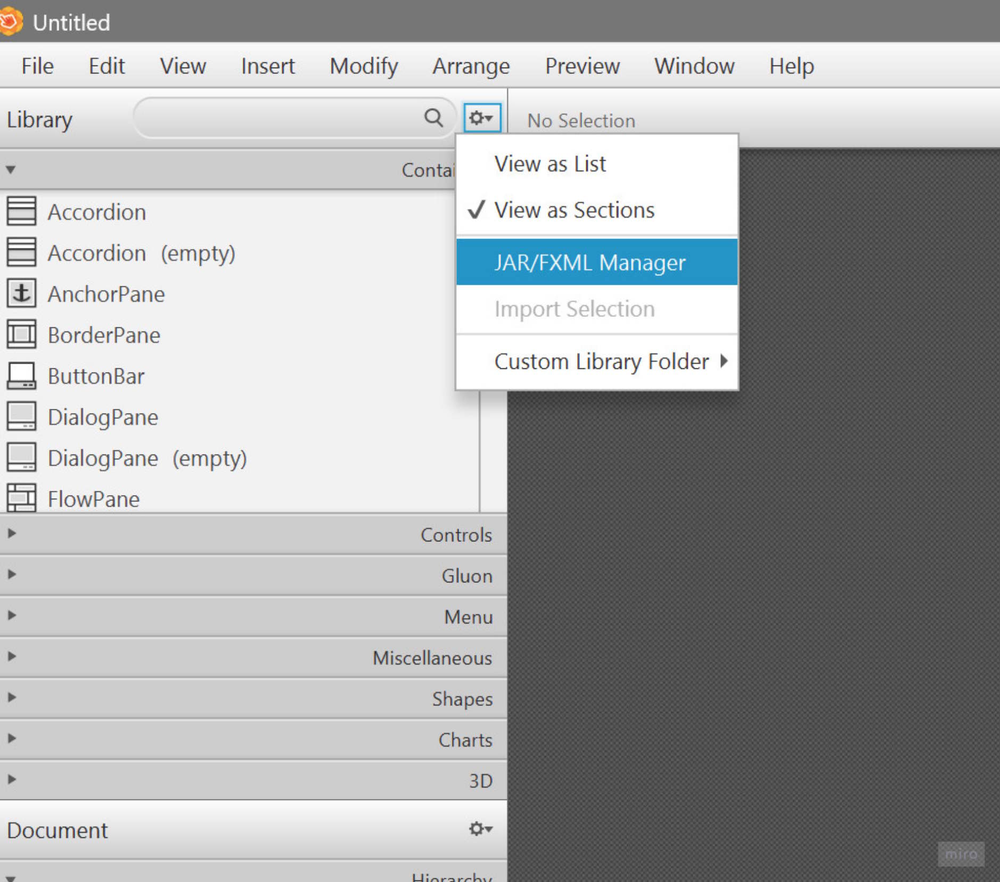

#### Add the `PlayWallClient` target folder as root folder
- Click `Add root folder wth *.class files`
- Select the following folder: `<path_to_your_working_copy/PlayWallClient/target/classes`

#### Add TheCodeLabs maven repository
- Click `Manage repositories`
- Click `Add`
- Create a new repository for `https://maven.thecodelabs.de/artifactory/TheCodeLabs-release`

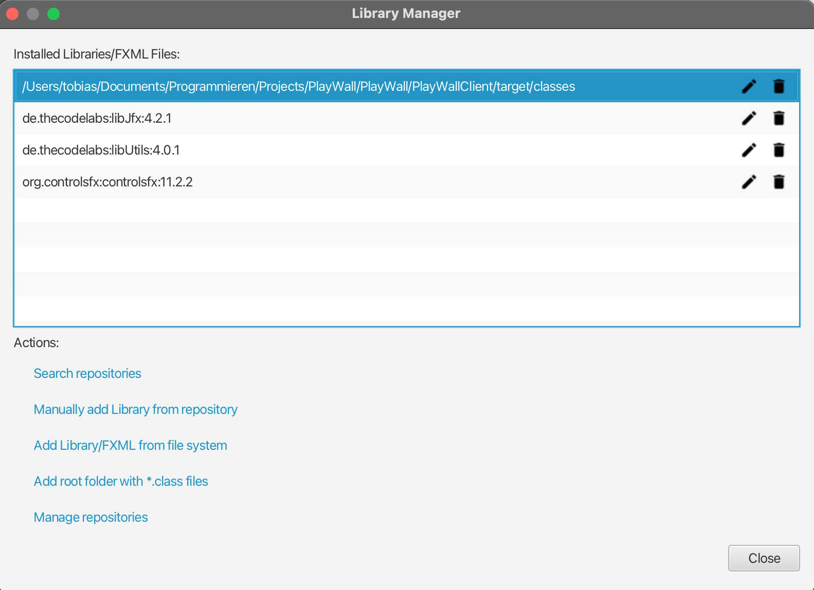

#### Add additional JARs as repositories
- Click `Search repositories`
- Search for the following libraries, select and add them:
  - `de.thecodelabs:libJfx`
  - `de.thecodelabs:libUtils`
  - `org.controlsfx:controlsfx`

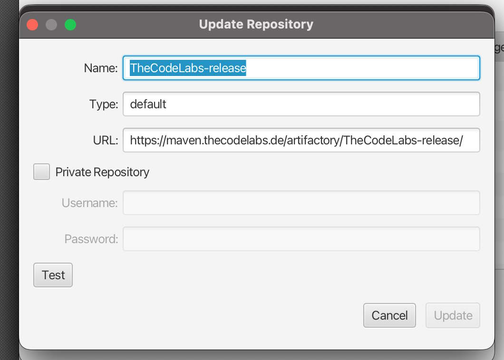

## Debugging

### Client

Start the client with the `--debug` flag to enable two additional keyboard shortcuts:

```bash
mvn javafx:run -pl PlayWallClient -Dexec.args="--debug"
```

| Shortcut (Win/Linux) | Shortcut (macOS) | Action                                                                                                                                    |
|----------------------|------------------|-------------------------------------------------------------------------------------------------------------------------------------------|
| `Ctrl+Shift+F12`     | `Cmd+Shift+F12`  | Open [ScenicView](https://github.com/JonathanGiles/scenic-view), a live inspector for the JavaFX scene graph (node tree, CSS, properties) |
| `Ctrl+Shift+F11`     | `Cmd+Shift+F11`  | Copy the currently loaded project as JSON to the system clipboard                                                                         |

The "Debug" checkbox in the program settings is unrelated to the shortcuts above — it only raises the log level
to `DEBUG` on the next launch (via a flag file in the config directory), which can also be filtered live in the
in-app log viewer.

### Server

The server exposes a debug-only REST endpoint that dumps the currently loaded project:

```
GET http://localhost:10023/debug/current-project
```

It returns the server-side `Project` domain model as JSON (no authentication, no parameters). There is no
`server.servlet.context-path` configured, so the endpoint is reachable directly under the server's root, alongside
port `10023` from [Run](#run).

## MacOS Signing

### Prerequisites

1. Create a macOS code signing certificate (Developer ID Application) in Apple Developer Portal and import it into
   Keychain.
2. Create an appstore connect API key

### Local development and release signing

1. Add the following to your `.m2/settings.xml` file:

```xml
<profiles>
    <profile>
        <id>macos-sign</id>
        <properties>
            <mac.sign.identity>[YOUR APPLICATION CERTIFICATE NAME]</mac.sign.identity>
            <mac.sign.keychain>[FULL PATH TO KEYCHAIN FILE]</mac.sign.keychain>
            <mac.notary.key>[FULL PATH TO APPSTORE CONNECT API KEY]</mac.notary.key>
            <mac.notary.key.id>[APPSTORE CONNECT KEY ID]</mac.notary.key.id>
            <mac.notary.issuer>[APPSTORE CONNECT ISSUER]</mac.notary.issuer>
        </properties>
    </profile>
</profiles>

<activeProfiles>
<activeProfile>macos-sign</activeProfile>
</activeProfiles>
```

### GitHub Actions

The following secrets must be set in the GitHub repository:

* `AC_ISSUER`: Appstore Connect API Key Issuer
* `AC_KEY`: Appstore Connect API Key (base64 encoded file)
* `AC_KEY_ID`: Appstore Connect API Key ID
* `CERT_PASSWORD`: Password for `DEVELOPER_ID_P12_BASE64`
* `DEVELOPER_ID_P12_BASE64`: Developer ID Application certificate and private key (base64 encoded file)
* `MAC_SIGN_IDENTITY`: Keychain entry name (e.g. `Developer ID Application: [Name] ([XXXXXXXXX])`)
* `MAVEN_PASSWORD`: Password for deploying to maven repository
* `MAVEN_USERNAME`: Username for deploying to maven repository
* `TEAM_ID`: Apple Developer Portal Team ID
